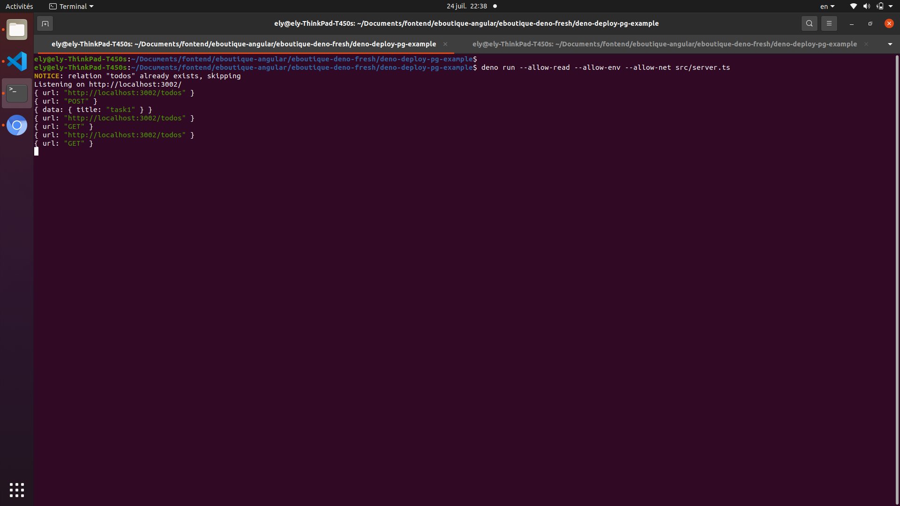
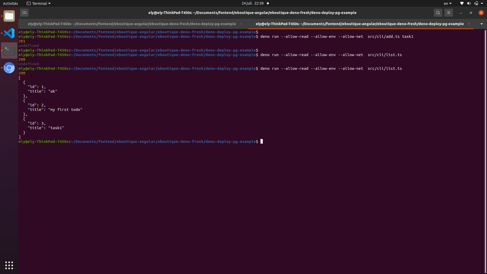

# deno delpoy with postgres
this is based on https://deno.com/deploy/docs/tutorial-postgres but bug fixed(title ) and exta feature like client based on fetch api (powred by deno) but you still to stup your pg db in local and update .env content to correspond to your db params, once done run the following command 

```

deno run --allow-read --allow-env --allow-net src/server.ts

```

<br />
 then open new tab and run 

 ```

deno run --allow-read --allow-env --allow-net  src/cli/add.ts task1

```
to add new todo (you can read src/cli/add.ts for butter understand)

 then open new tab and run 
```
deno run --allow-read --allow-env --allow-net  src/cli/list.ts
```

to list existing todos like in following image

<br />

# bug fixed 
in https://deno.com/deploy/docs/tutorial-postgres the following condition :

```
typeof title !== "string" 

```
will never satisfied, title will be object or undefined because is json data.

# suggestion

basic examples must be tested too like deno base code.

 